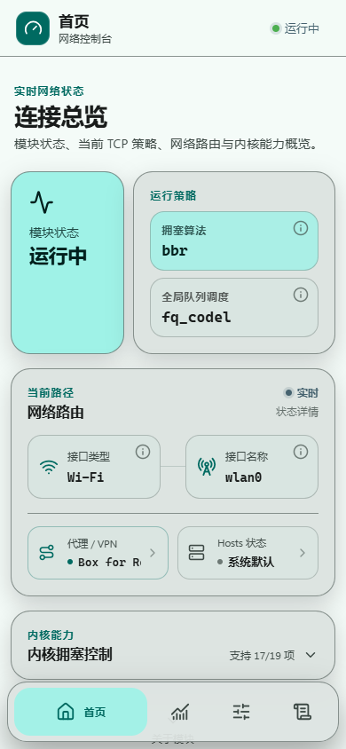
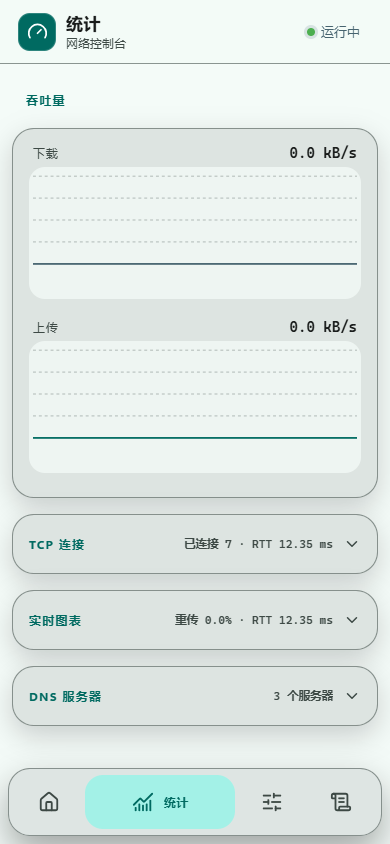
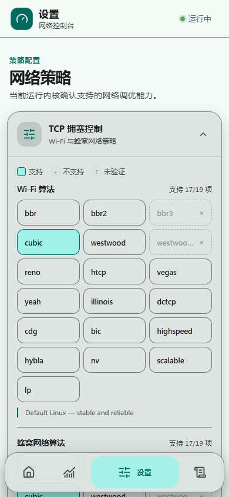

# TCP Optimiser

<p align="right"><a href="./README.md">简体中文</a> · <strong>English</strong></p>

> A Magisk / KernelSU module for dynamic TCP congestion control, with a Material Design 3 WebUI.

[](https://github.com/Zhanfg/TCP_Optimiser_RS/releases)
[](LICENSE)
[](https://github.com/Zhanfg/TCP_Optimiser_RS/actions/workflows/build.yml)

TCP Optimiser detects the active Wi-Fi or cellular interface and applies a kernel-supported TCP congestion-control policy, qdisc configuration and pacing parameters. Its WebUI presents the actual module state, active route, proxy core, kernel capabilities and network statistics.

## Screenshots

<table>
  <tr>
    <td align="center"><strong>Home</strong><br></td>
    <td align="center"><strong>Statistics</strong><br></td>
  </tr>
  <tr>
    <td align="center"><strong>Settings</strong><br></td>
    <td align="center"><strong>Logs</strong><br></td>
  </tr>
</table>

> Screenshots use the Simplified Chinese interface. English can be selected from **Settings → Appearance → Language**.

## Features

### Rust core

- Detects Wi-Fi and cellular interfaces and switches policies automatically.
- Supports 19 congestion-control algorithms: BBR, BBR2, BBR3, CUBIC, Westwood, Westwood+, Reno, HTCP, Vegas, YeAH, Illinois, DCTCP, CDG, BIC, HighSpeed, Hybla, NV, Scalable and LP.
- Applies per-algorithm qdisc, `pacing_ca`, `pacing_ss`, `initcwnd` and `initrwnd` settings.
- Detects VoWiFi state before applying Wi-Fi policy.
- Uses adaptive polling: faster after an interface change and slower while stable.
- Adjusts pacing for 2.4, 5 and 6 GHz Wi-Fi bands.

### WebUI

- Four primary views: Home, Statistics, Settings and Logs.
- Live throughput, retransmission, congestion-window and RTT charts.
- A single Rust JSON snapshot supplies runtime state and statistics, while the WebUI verifies saved policy against live kernel values and the interface qdisc; detected drift can be repaired without intentionally terminating existing connections.
- Proxy detection with application name, package name, core name/version, VPN and TPROXY evidence.
- Hosts-file detection for system defaults and common systemless hosts modules.
- Per-interface DNS display and detailed network-route status.
- Material Design 3 cards, collapsible sections, motion transitions and optional haptic feedback.
- Floating pill navigation: inactive tabs show icons; the active tab also shows its label.
- Light, dark and automatic themes with optional Android dynamic color.
- Responsive layouts from 320 px Android WebUI to desktop browsers.

### Policy and advanced controls

- Shows every known algorithm and qdisc with **supported**, **unsupported** or **unverified** state reported by the current kernel.
- Nine qdiscs: `fq`, `fq_codel`, `cake`, `pfifo_fast`, `codel`, `fq_pie`, `pfifo`, `pie` and `pfifo_head_drop`; applications are read back and automatically reconciled after network or kernel resets.
- Five built-in presets plus JSON import/export for custom presets.
- 39 runtime-detected advanced kernel parameters covering lifecycle, buffers, queues, loss recovery, PLB, low-latency polling and conntrack. Nodes absent from the running kernel remain unavailable and are never written.
- Baseband partition discovery and backup with an automatically generated restore script.
- Simplified Chinese and English interfaces with 279 validated translation entries.

### Transactional rollback

- The first installation records every available sysctl value the module can modify instead of assuming generic platform defaults.
- Upgrades preserve the first snapshot, preventing values written by an older module build from becoming the new baseline.
- The original root qdisc is journaled separately before each Wi-Fi or cellular interface is modified for the first time.
- Early boot and the daemon refuse to apply tuning if the snapshot is missing, malformed or uses an unsupported schema version.
- Uninstall restores and reads back each recorded value. If exact restoration is unavailable, errors are reported and the module does not force `cubic/fq_codel`.

See [`docs/ROLLBACK-SAFETY.md`](docs/ROLLBACK-SAFETY.md) for the lifecycle, trust boundary and restoration scope.

## Installation

1. Download `TCP_Optimiser_RS-v*.zip` from [Releases](https://github.com/Zhanfg/TCP_Optimiser_RS/releases).
2. Flash it in Magisk Manager or KernelSU Manager.
3. Reboot the device.
4. Open the module WebUI from the supported root manager.

The module requires a kernel that exposes `/proc/sys/net/ipv4/tcp_available_congestion_control` and provides the required traffic-control support. Release packages include `arm64-v8a`, `armeabi-v7a` and `x86_64` binaries; actual algorithm and qdisc availability depends on the device kernel.

## Presets

| Preset | Wi-Fi | Cellular | qdisc | Pacing | Intended use |
|---|---|---|---|---:|---|
| Balanced | CUBIC | CUBIC | fq_codel | 150/200 | General use |
| Gaming | BBR | BBR | fq | 200/300 | Low latency |
| Streaming | BBR | CUBIC | fq_codel | 180/250 | Sustained throughput |
| Battery Saver | Vegas | Westwood | fq_codel | 120/180 | Lower background activity |
| High-Speed | BBR3 | BBR3 | fq | 220/320 | Maximum throughput on supported kernels |

## Build and release integrity

```sh
cargo fmt --all -- --check
cargo test --all-targets --locked
cargo clippy --all-targets --locked -- -D warnings
```

Every push and pull request validates Rust, WebUI, metadata and shell scripts, then builds the three Android ABIs in parallel. Successful non-PR builds upload a validated module ZIP and its SHA-256 file. A tag matching `v<module.prop version>` creates or updates the corresponding GitHub Release.

Official CI binaries use LTO, symbol stripping, source-path remapping and an embedded repository/commit watermark. Flashable packages contain an Ed25519-signed SHA-256 manifest; the Rust installer verifies the signature and every protected module file before installation. Modified or incomplete packages are rejected. Public-repository builds also receive a GitHub artifact attestation.

Local builds remain unobfuscated development builds and identify themselves through `tcp_optimiser build-info`.

## Project lineage

This project was inspired by the functional ideas and usage scenarios explored by the earlier TCP Optimiser module. Its Rust core was independently redesigned and implemented rather than produced as a line-by-line translation or direct port of the earlier C++/shell implementation. Any third-party code or assets retained in this repository remain subject to their respective copyright and license terms.

## Authors

- [fatalcoder524](https://github.com/fatalcoder524) — earlier module and original functional concept
- [axymorrsen](https://github.com/Zhanfg) — current Rust implementation, WebUI redesign, statistics, presets and advanced kernel tuning

## License

GPL-3.0 © 2025–2026 fatalcoder524 & axymorrsen

## Links

- [GitHub repository](https://github.com/Zhanfg/TCP_Optimiser_RS)
- [Releases](https://github.com/Zhanfg/TCP_Optimiser_RS/releases)
- [Telegram](https://t.me/TCP_Optimiser)
- [Earlier module](https://github.com/fatalcoder524/TCP_Optimiser_Module)
